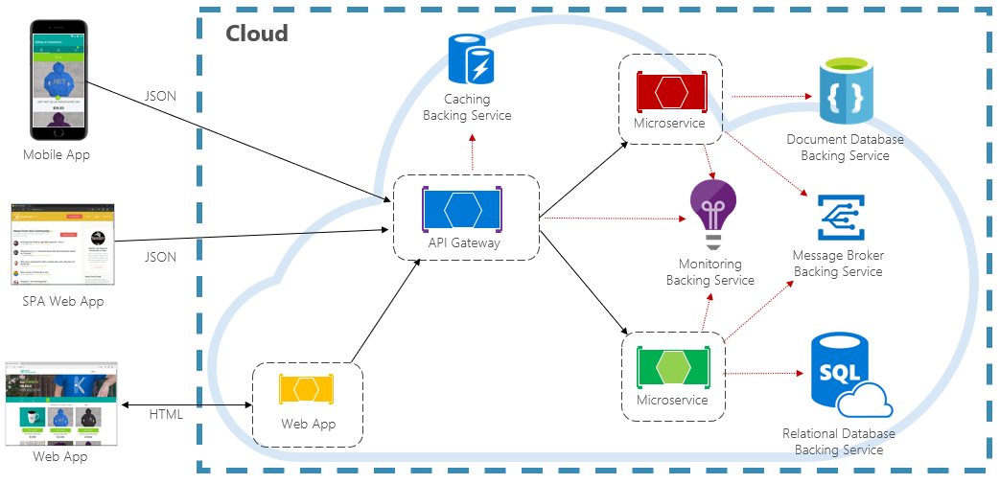

# Cloud-native resiliency

Resiliency is the ability of your system to react to failure and still remain functional. It's not about avoiding failure, but accepting failure as inevitable and building your in cloud-native services to respond to it. The end-goal of resiliency is to return the application to a fully functioning state after a failure.

> Discuss Resil, Redund, Consistency, and Avail

Unlike traditional monolithic applications, where everything runs together in a single process, cloud-native systems embrace a distributed architecture as shown in Figure 6-1:

**Figure 6-1.** Distributed cloud-native environment

In the previous figure, note how each client, microservice, and cloud-based [backing service](https://12factor.net/backing-services) executes as a separate process, running across different server infrastructure, all communicating via network-based calls.

With such a design, what could go wrong?

- Unexpected [network latency](https://www.techopedia.com/definition/8553/network-latency).
- [Transient faults](https://docs.microsoft.com/azure/architecture/best-practices/transient-faults)
    (temporary network connectivity errors).
- Blockage by a long-running synchronous operation.
- A host process that has crashed and is being restarted or moved.
- An overloaded microservice that can't respond for a short time.
- An in-flight Orchestrator operation such as a rolling upgrade or moving a service from one node to another.
- Hardware failures from commodity hardware.

When deploying distributed services in a cloud-based infrastructure, these factors become very real and you must design and develop defensively to deal with them.

In a smaller system, failure will be less frequent, but as that system scales up and out, you can expect to experience more and more issues - to a scale, perhaps,  where partial failure could become normal operation.

Therefore, your application and infrastructure must be resilient. In the following sections, we'll explore defensive techniques that you can add to your application and managed cloud resources to minimize downtime and disruption.

>[!div class="step-by-step"]
>[Previous](elastic-search-in-azure.md)
>[Next](application-resiliency-patterns.md)
